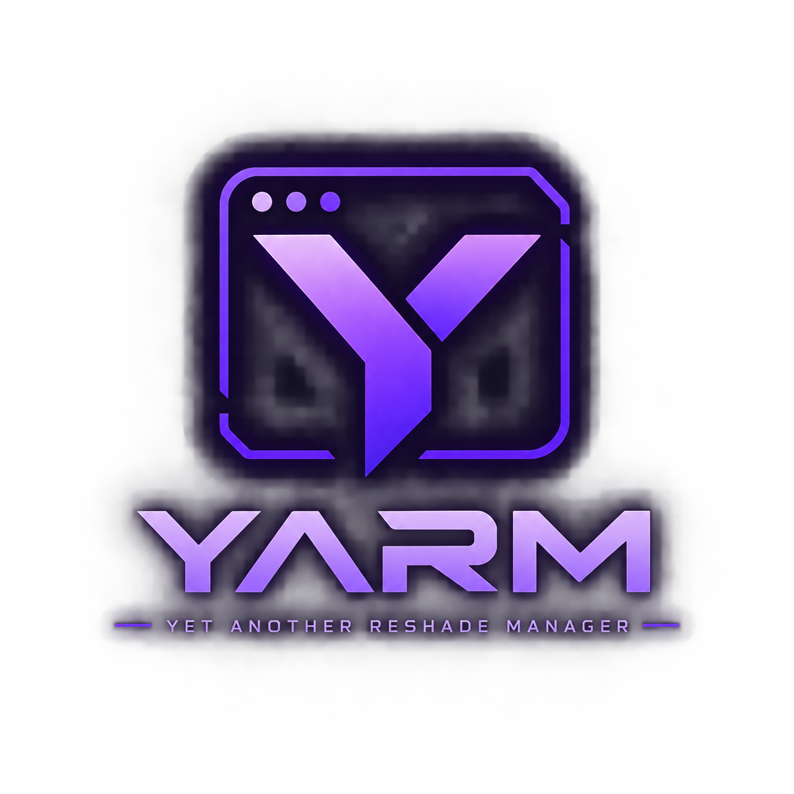
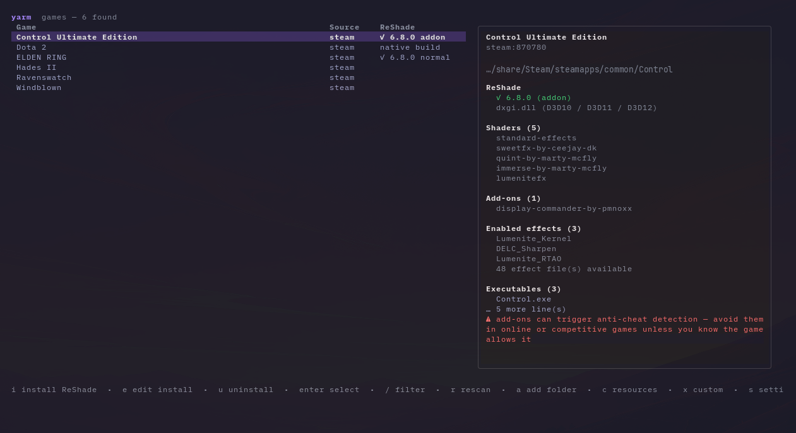

<div align="center">



# YARM — Yet Another ReShade Manager

**Install ReShade in your games from the terminal, and take it back out just as easily.**

[](https://github.com/secato/yarm/actions/workflows/ci.yml)
[](https://github.com/secato/yarm/releases)
[](https://goreportcard.com/report/github.com/secato/yarm)
[](LICENSE)

</div>

YARM finds your games, installs [ReShade](https://reshade.me/) into the ones you
choose along with the shaders and add-ons you want, and keeps track of every
file it put there — so uninstalling gives you the folder back exactly as it was.

It is a single binary with no runtime, no installer and no launcher running in
the background. It runs on **Windows and Linux**, including Steam Deck and
Proton.

> Built with [Claude Code](https://claude.com/claude-code) — vibecoded, and
> tested like it wasn't.

<div align="center">



</div>

> **Status: pre-release.** Everything described here works, but there is no
> tagged release yet.

## What it does for you

**Finds your games.** Steam libraries are detected automatically, wherever they
live. Anything else — GOG, Epic, a folder you unzipped somewhere — you add by
path, once. Automatic discovery for GOG, Epic and the other launchers is
planned.

**Installs ReShade the right way for each game.** YARM looks at the game's
executable to work out whether it is 32- or 64-bit and which graphics API it
uses, then picks the matching ReShade build and proxy DLL for you. You can
override any of it if you know better.

**Gives you the shaders people actually use.** The wizard opens on a curated
shortlist — SweetFX, iMMERSE, qUINT, METEOR, LumeniteFX and the rest — instead
of a wall of a hundred packages. One key widens it to the full catalog when you
want something specific.

**Handles dependencies for you.** Some add-ons need a particular shader to work
at all. Pick the AutoHDR add-on and YARM selects the tone-mapping shader it
needs, and tells you why it did.

**Downloads once, not once per game.** Everything is cached and shared, so
installing the same shader pack into a fifth game copies files rather than
re-downloading them. You can see what is cached, what it costs in disk space,
and which games are using it.

**Uninstalls cleanly.** YARM records every file it writes. Uninstall removes
exactly those and nothing else — your presets, screenshots and edited configs
stay. If it had to replace a file that was already there, it kept a copy and
puts it back.

**Tells you before it overwrites anything.** If something else already occupies
the DLL slot ReShade needs — another injector, or a ReShade you installed by
hand — YARM says so before it starts, not after.

**Takes over installs you did by hand.** Point it at a game you set up
yourself and it can adopt that install and manage it from then on.

**Lets you bring your own.** Drop your own shaders or add-ons into a folder and
they appear in the wizard next to the catalog ones.

**Warns you about anti-cheat.** The add-on build of ReShade is detectable.
YARM says so, in red, on every screen where it matters — never install it into
a game you play online.

**Tells you what it cannot do.** Vulkan and D3D8 are not supported yet. YARM
says so while you are still choosing, rather than leaving you to work it out
from a game that starts without ReShade.

## Installing YARM

| Platform | How |
| --- | --- |
| **Windows / Linux** | Download the zip or tar.gz from [Releases](https://github.com/secato/yarm/releases) and run `yarm`. There is nothing to install. |
| **Arch Linux** | `yay -S yarm-bin` |
| **From source** | `go install github.com/secato/yarm/cmd/yarm@latest` |

## Using it

Run `yarm`. Every screen lists its keys along the bottom and `?` opens the full
help, so there is nothing to memorise: arrows move, `enter` goes in, `esc` goes
back.

Nothing is written to a game folder until you confirm on the review page, which
shows what is already in the folder and what will happen to it, along with
anything still to download.

## Adding your own shaders and add-ons

Anything you put in yarm's `custom/` folder shows up in the wizard beside the
catalog packages:

```
custom/
├── shaders/<name>/Shaders/*.fx  Textures/*
└── addons/<name>/*.addon32|*.addon64
```

By default that is:

| OS | Folder |
| --- | --- |
| **Linux** | `~/.local/share/yarm/custom/` (or `$XDG_DATA_HOME/yarm/custom/`) |
| **Windows** | `%LOCALAPPDATA%\yarm\custom\` |

It lives with your data rather than in the cache, so clearing yarm's downloads
— or your `~/.cache` — never touches it. If you have set `YARM_HOME`, the folder
is `$YARM_HOME/data/custom/` instead.

## Documentation

[`CONTRIBUTING.md`](CONTRIBUTING.md) covers the package layout, building and
testing, and how to add support for another game library.

## Credits

- [ReShade](https://reshade.me/) by crosire.
- Effect package and add-on catalogs from the
  [reshade-shaders](https://github.com/crosire/reshade-shaders) `list` branch.
- Inspired by [LeShade](https://github.com/Ishidawg/LeShade) and
  [reshade-steam-proton](https://github.com/kevinlekiller/reshade-steam-proton).

## License

[MIT](LICENSE)
